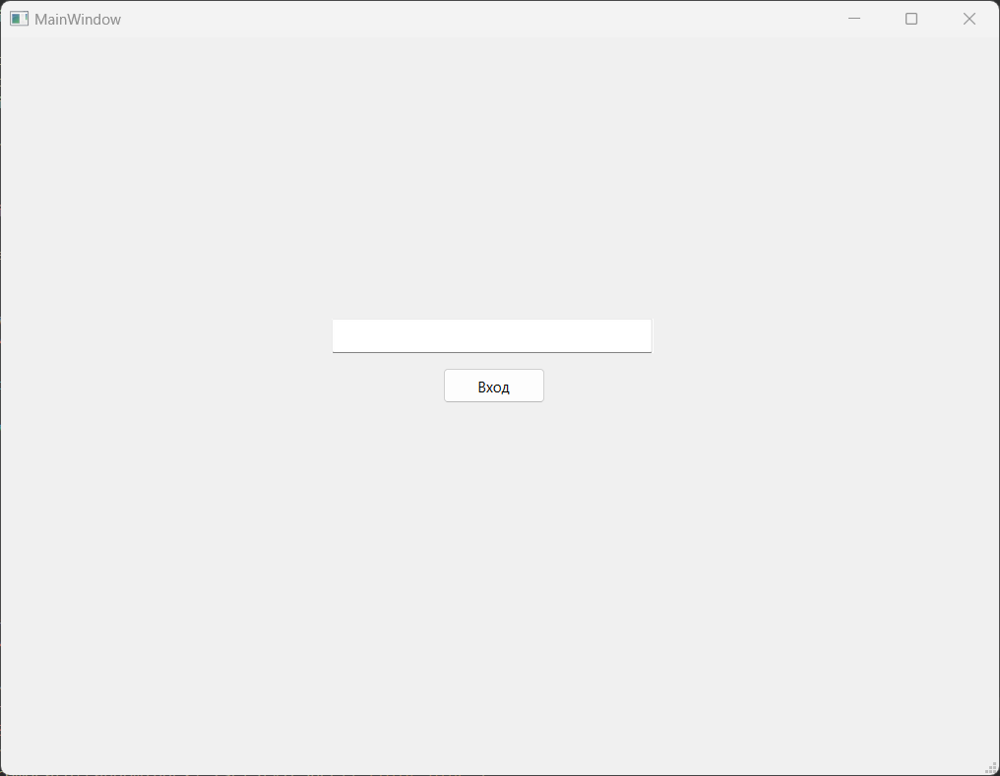
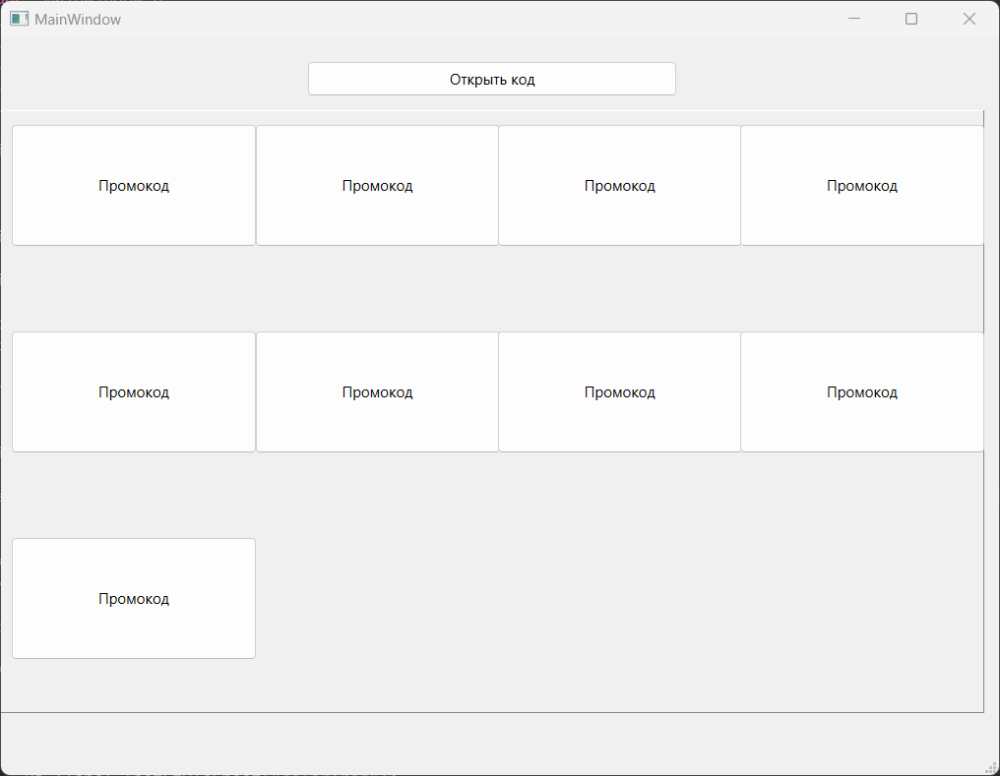
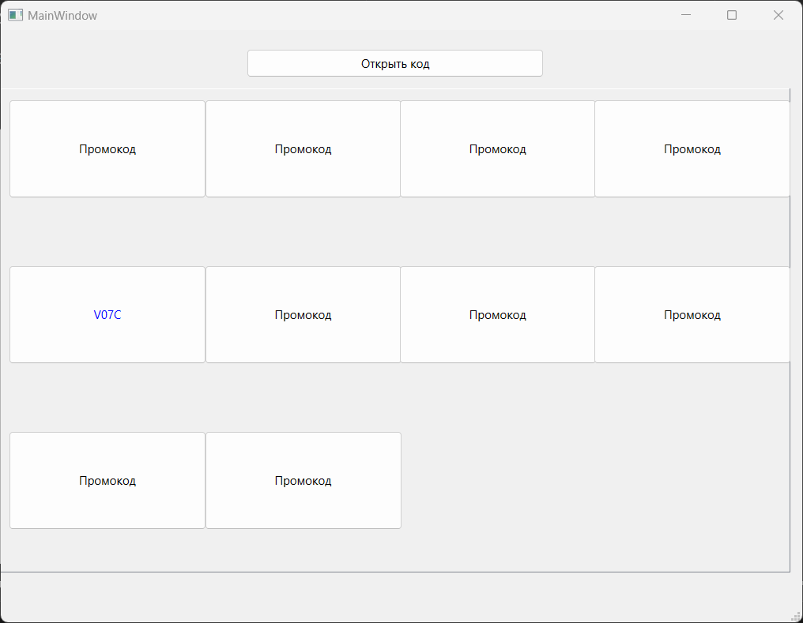

# PromoCode Application

## Описание

Это приложение на C++ с использованием Qt и OpenSSL, которое предоставляет интерфейс для генерации и отображения промокодов. Промокоды шифруются с использованием алгоритма AES-256, чтобы защитить их от дампа памяти.
## Снимки интерфейса

### Страница авторизации

На этой странице пользователь может ввести пин и зайти в приложение
### Страница промокодов

На этой странице пользователь может увидеть закрытые промокоды
### Промокод раскрыт

На этой странице пользователь уже открыл один из промокодов